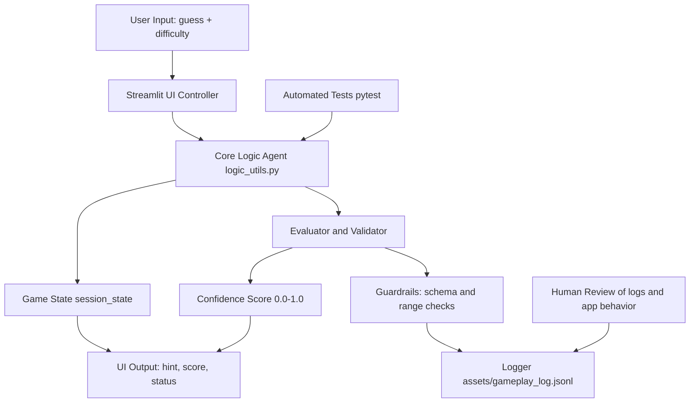
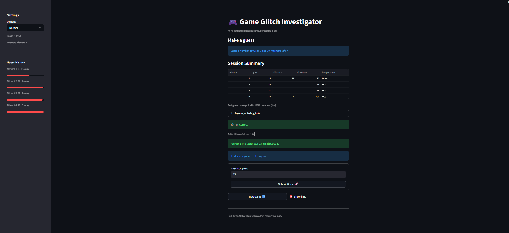
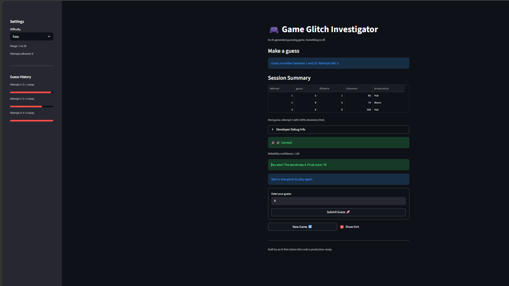

# Game Glitch Investigator

Game Glitch Investigator is a Streamlit app that helps players find a secret number while exposing game logic in a transparent, testable way. The project started as a broken AI-generated game and evolved into a reliable system with guardrails, confidence scoring, and structured logging. Its value is that it demonstrates practical AI-system engineering: debugging, validation, observability, and reproducible execution.

## Core Utility and AI Capability

- Primary use case: debugging, classifying, and explaining game outcomes (Win, Too High, Too Low) with confidence feedback.
- Advanced capability integrated into main logic: reliability and testing system.
- Deep integration points:
  - Each valid guess produces a confidence score.
  - Each guess event is validated by guardrails before logging.
  - Structured JSONL logs capture decisions for auditing and review.

## System Architecture



## Data Flow (Input to Output)

1. Input: the player submits a guess and selected difficulty.
2. Process: input is parsed and range-checked.
3. Process: core logic classifies outcome (Win, Too High, Too Low) and updates score/state.
4. Process: evaluator computes confidence and validates the event payload with guardrails.
5. Process: if valid, event is appended to JSONL log; if invalid, the app surfaces a safety message and records the issue in an error log.
6. Output: player sees hint, score, attempts left, confidence, and game status.

## Validation and Human-in-the-Loop

- Automated checkpoint: unit tests validate game logic, scoring, parsing, confidence, guardrails, and log writing.
- Runtime checkpoint: event validator blocks malformed data before it is persisted.
- Failure audit checkpoint: runtime exceptions and guardrail violations are written to `assets/error_log.jsonl` for later review.
- Human checkpoint: developer can inspect Debug Info and JSONL logs to audit model-like behavior and reliability.

## Setup Iinstructions

1. Clone repository:
   ```bash
   git clone https://github.com/Sley-CS/applied-ai-system-final.git
   cd applied-ai-system-final
   ```
2. Create and activate a virtual environment:
   ```bash
   python -m venv .venv
   .venv\Scripts\activate
   ```
3. Install dependencies:
   ```bash
   pip install -r requirements.txt
   ```
4. Run tests:
   ```bash
   pytest -q
   ```
5. Launch app:
   ```bash
   python -m streamlit run app.py
   ```

## Sample Interactions

1. In-range, too low guess
   - Input: difficulty Normal (1-50), secret 37, guess 25
   - Output: outcome Too Low, hint "Go HIGHER", confidence around 0.7, attempts incremented

2. In-range, too high guess
   - Input: difficulty Normal (1-50), secret 37, guess 44
   - Output: outcome Too High, hint "Go LOWER", confidence around 0.8, score adjusted

3. Winning guess
   - Input: difficulty Normal, secret 37, guess 37
   - Output: outcome Win, confidence 1.0, success banner, final score shown

## Screenshots





## Design Decisions

- Reliability over minimal code: added validation and logs, which increases code complexity but improves trust and debuggability.
- Interpretable confidence over model-based confidence: confidence is rule-based (distance-derived) and easy to audit, but less expressive than a learned model.
- Fast local reproducibility over cloud dependencies: no external model API is required, reducing setup friction but limiting advanced language capabilities.

## Testing Summary

- Method used: automated unit tests with pytest + runtime guardrails + manual UI inspection.
- Quantitative result: see test output section below (updated from latest run).
- Qualitative insights:
  - System behaves consistently when session state and validation rules are enforced.
  - Edge-case input handling is stronger for empty, non-numeric, scientific, and out-of-range values.
- Iteration outcome:
  - Reliability improved after adding event schema checks and confidence bounds validation.

## Reflection

Building the Game Glitch Investigator taught me that AI is a powerful partner, but it’s not magic. I learned that trusting its output without verification is risky, so I focused on building simple checks to catch errors. Ultimately, this project showed me that good problem-solving isn’t just about writing complex code it’s about guiding the AI with clarity, staying curious when things go wrong, and always keeping the human impact in mind
